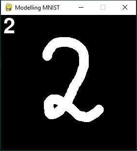

# MNIST-pygame-repo

A simple user interface using Pygame for drawing digits and testing the MNIST classification neural net from Tensorflow.  

Controls:  
SPACE: screenshots the window   
P: uses the model to predict the digit you drew  
LSHIFT: trigger eraser mode  
RSHIFT: trigger pen mode  
L_CLICK: draw/erase

Step 1: draw using the mouse in pen mode  
Step 2: press SPACE to take a screenshot  
Step 3: press P to make the model predict  
Step 4: erase and repeat!  

Model is the exact code from https://www.tensorflow.org/datasets/keras_example  

Built with Pygame 1.9.6 and Tensorflow 2.3.1
